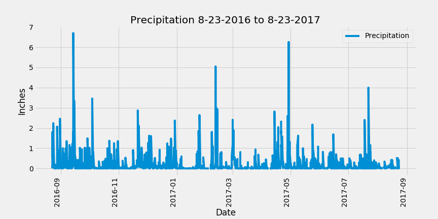
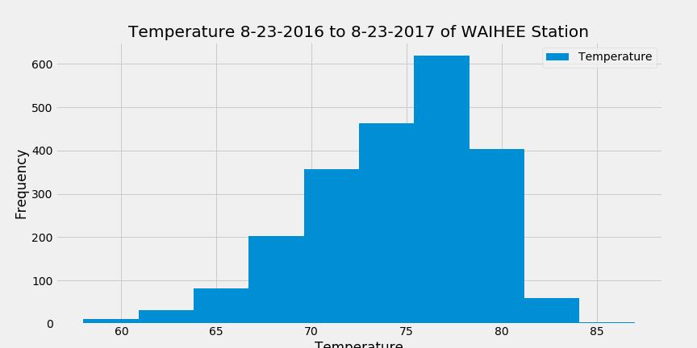

# Project: Climate Analysis and App

## Objective: 
Conduct data analysis and data exploration of climate database from Hawaii from 2010-01-01 to 2017-08-23 using queries, plots and API app

## Tools:
* Python
* Jupyter Lab
* Libraries: SQLAlchemy, Pandas, Numpy, Matplotlib, Datetime, Collections, Json, Flask

## Assignment:
* Design query to review last 12 months of precipitation data, load into Pandas DataFrame, create plot

* Design query to analyze weather stations
* Design query to review last 12 months of temperature observation data, load into Pandas DataFrame, create plot

* Design Flask API to create routes to each query

## Final Files

* climate_sqlalchemy.ipynb
* climate_flask.py
